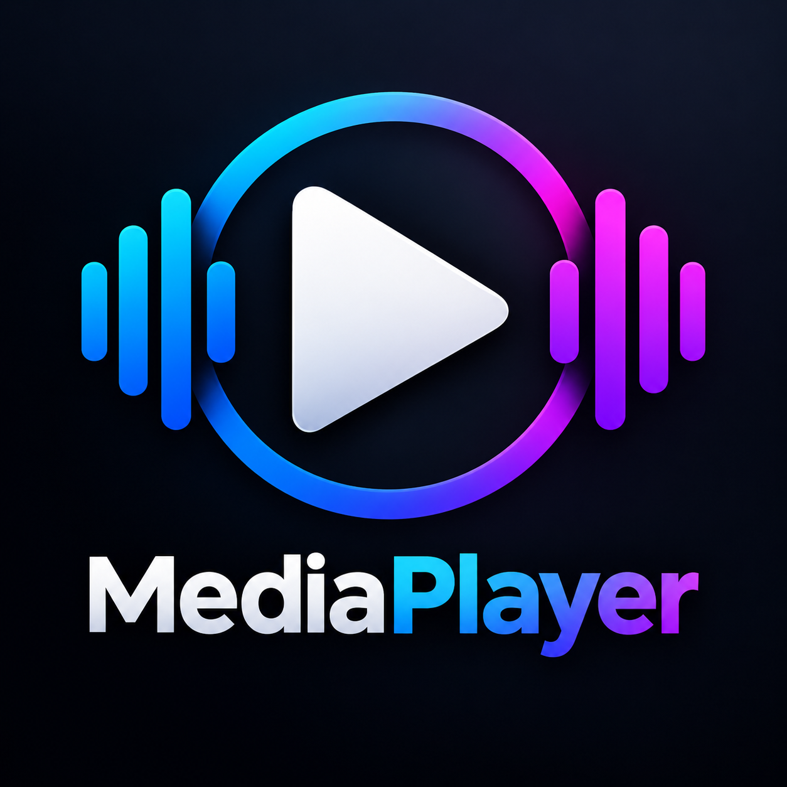

<div align="center">



# MediaPlayer

### Reproductor multimedia para Windows desarrollado con C# y .NET 8

Reproductor de audio y video para Windows desarrollado con **C#**, **.NET 8** y **Windows Forms**, utilizando **LibVLCSharp** como integración con el motor multimedia **VideoLAN LibVLC**.

Incluye reproducción multimedia, listas de reproducción, ecualizador de 10 bandas, visualizador de espectro de audio, pantalla completa, MiniPlayer y controles mediante teclado.

<br>

<a href="https://github.com/eherca0502/MediaPlayer/releases">
  
</a>

</div>

---

## Descripción

**MediaPlayer** es una aplicación de escritorio para Windows diseñada para reproducir contenido multimedia de manera sencilla y funcional.

El proyecto fue desarrollado utilizando **C# y .NET 8**, con **Windows Forms** para la interfaz gráfica y **LibVLCSharp** junto con **VideoLAN LibVLC** para la reproducción de audio y video.

Además, incorpora **NAudio** para el análisis de audio en tiempo real utilizado por el visualizador de espectro.

El proyecto busca combinar una interfaz sencilla con funciones habituales de un reproductor multimedia de escritorio.

---

## Características

### Reproducción multimedia

* Reproducción de audio y video.
* Reproducir, pausar y detener contenido.
* Anterior y siguiente.
* Control de posición de reproducción.
* Adelantar y retroceder.
* Control de volumen.
* Compatibilidad con múltiples formatos multimedia.

### Lista de reproducción

* Creación y administración de playlist.
* Agregar archivos multimedia.
* Agregar carpetas.
* Soporte para Drag & Drop.
* Navegación entre archivos.
* Reproducción aleatoria.
* Repetición.

### Audio

* Ecualizador de 10 bandas.
* Visualizador de espectro en tiempo real.
* Presets de ecualización.
* Análisis de audio mediante NAudio.

### Interfaz

* Pantalla completa.
* MiniPlayer.
* MiniPlayer automático al minimizar la aplicación.
* Atajos de teclado.
* Controles de reproducción.
* Icono personalizado para Windows.

---

## Ecualizador

MediaPlayer incluye un ecualizador de **10 bandas de frecuencia**:

| Banda | Frecuencia |
| ----- | ---------: |
| 1     |      31 Hz |
| 2     |      62 Hz |
| 3     |     125 Hz |
| 4     |     250 Hz |
| 5     |     500 Hz |
| 6     |      1 kHz |
| 7     |      2 kHz |
| 8     |      4 kHz |
| 9     |      8 kHz |
| 10    |     16 kHz |

### Presets disponibles

* Normal
* Rock
* Pop
* Clásica
* Electrónica
* Voz
* Bass Boost

---

## Visualizador de audio

El reproductor incluye un **visualizador de espectro de audio en tiempo real**.

Durante la reproducción, el sistema analiza la señal de audio y representa visualmente diferentes rangos de frecuencia mediante barras dinámicas.

El análisis de audio se realiza utilizando **NAudio**.

---

## MiniPlayer

MediaPlayer cuenta con un **MiniPlayer** diseñado para ofrecer controles básicos mientras se mantiene la ventana principal minimizada.

El MiniPlayer puede aparecer automáticamente al minimizar la aplicación.

Permite:

* Reproducir / pausar.
* Cambiar de archivo.
* Controlar el volumen.
* Cambiar la posición de reproducción.
* Restaurar la ventana principal.
* Ocultar el MiniPlayer.

---

## Atajos de teclado

| Tecla   | Acción                     |
| ------- | -------------------------- |
| `Space` | Reproducir / Pausar        |
| `←`     | Retroceder                 |
| `→`     | Adelantar                  |
| `↑`     | Subir volumen              |
| `↓`     | Bajar volumen              |
| `F11`   | Activar pantalla completa  |
| `Esc`   | Salir de pantalla completa |

---

## Formatos compatibles

MediaPlayer utiliza **VideoLAN LibVLC** como motor multimedia, por lo que puede reproducir una amplia variedad de formatos de audio y video.

### Video

* MP4
* MKV
* AVI
* MOV
* WMV
* WebM

### Audio

* MP3
* WAV
* FLAC
* M4A
* OGG
* AAC
* WMA

> La compatibilidad final depende de los códecs y capacidades disponibles en la versión incluida de LibVLC.

---

## Tecnologías utilizadas

| Tecnología          | Uso                              |
| ------------------- | -------------------------------- |
| **C#**              | Lenguaje principal               |
| **.NET 8**          | Plataforma de desarrollo         |
| **Windows Forms**   | Interfaz de escritorio           |
| **LibVLCSharp**     | Integración de LibVLC con .NET   |
| **VideoLAN LibVLC** | Motor de reproducción multimedia |
| **NAudio**          | Análisis de audio en tiempo real |

---

## Estructura del proyecto

```text
MediaPlayer/
│
├── Assets/
│   └── MediaPlayer.png
│
├── Controls/
│   └── AudioVisualizer.cs
│
├── Forms/
│   ├── MainForm.cs
│   ├── MainForm.Designer.cs
│   ├── MiniPlayerForm.cs
│   ├── MiniPlayerForm.Designer.cs
│   ├── EqualizerForm.cs
│   └── EqualizerForm.Designer.cs
│
├── Models/
│   └── MediaItem.cs
│
├── Services/
│   └── AudioSpectrumService.cs
│
├── Program.cs
├── MediaPlayer.csproj
└── README.md
```

---

## Requisitos

Para compilar el proyecto desde el código fuente se requiere:

* Windows 10 o superior.
* Visual Studio 2022.
* .NET 8 SDK.
* Entorno Windows de 64 bits recomendado.

### Ejecución del proyecto

Clona el repositorio:

```bash
git clone https://github.com/eherca0502/MediaPlayer.git
```

Entra al directorio:

```bash
cd MediaPlayer
```

Compila el proyecto:

```bash
dotnet build
```

Ejecuta la aplicación:

```bash
dotnet run --project MediaPlayer/MediaPlayer.csproj
```

También puedes abrir el proyecto directamente desde **Visual Studio 2022** y ejecutarlo mediante el depurador.

---

## Publicación

El proyecto puede publicarse como una aplicación independiente para **Windows x64**.

Ejemplo de publicación:

```powershell
dotnet publish .\MediaPlayer\MediaPlayer.csproj `
  -c Release `
  -r win-x64 `
  --self-contained true `
  -p:PublishSingleFile=false `
  -o "C:\MediaPlayer-Publish"
```

La publicación incluye los componentes necesarios para ejecutar la aplicación sin requerir una instalación independiente de .NET 8.

---

## Descargas

Las versiones compiladas y los instaladores se publican mediante la sección **Releases** de GitHub.

### Versión estable actual

**MediaPlayer v1.0.0**

Incluye el instalador para Windows:

```text
MediaPlayer-v1.0.0-Setup.exe
```

[Descargar la última versión](https://github.com/eherca0502/MediaPlayer/releases)

---

## Versión 1.0.0

### Primera versión estable

**MediaPlayer v1.0.0** representa la primera versión estable del proyecto.

Esta versión incluye:

* Reproducción de audio y video.
* Lista de reproducción.
* Reproducción aleatoria.
* Repetición.
* Ecualizador de 10 bandas.
* Visualizador de espectro de audio.
* Pantalla completa.
* MiniPlayer.
* Atajos de teclado.
* Icono personalizado.
* Instalador para Windows.

---

## Seguridad

Antes de la primera versión estable se realizó una revisión del proyecto enfocada en identificar patrones comunes relacionados con seguridad.

La versión publicada utiliza:

**VideoLAN LibVLC 3.0.24**

El proyecto no incluye intencionalmente:

* Contraseñas incrustadas.
* Claves API.
* Tokens de autenticación.
* Credenciales de usuario.

Tampoco utiliza intencionalmente ejecución de comandos externos, PowerShell o modificaciones del registro de Windows como parte de su funcionamiento normal de reproducción multimedia.

---

## Autor

**Eduardo Hernández**

Desarrollador de software.

* GitHub: [eherca0502](https://github.com/eherca0502)
* Portafolio: [eherca-portafolio.netlify.app](https://eherca-portafolio.netlify.app)

---

## Licencia

La información de licencia del proyecto se definirá de acuerdo con los términos de distribución establecidos para este repositorio.

---

<div align="center">

**MediaPlayer**

Reproductor multimedia para Windows desarrollado con C# y .NET 8.

**v1.0.0 — Primera versión estable**

</div>
